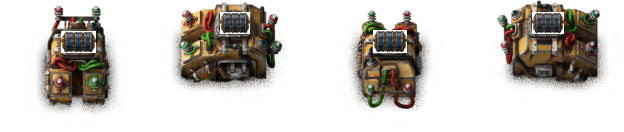

# Batch Request Combinator

Batch Request Combinator captures quality-aware item signals once, stages one exact logistics batch across requester chests, removes its requests before loading, and exposes an exclusive READY/COMPLETE circuit handshake.

The included Batch-Combinator Requester defaults to 5,000 inventory slots and uses Factorio's native exact logistic mode. Its capacity is configurable from 48 to 5,000 as a startup mod setting and does not scale with chest quality. Compatible ordinary non-exact requesters remain supported: robots may briefly overdeliver, but the owned request stays active with equal minimum and maximum values while Factorio returns the surplus through the chest's logistic trash inventory. Loading never starts until the main inventory equals its allocation, the trash inventory is empty, and both native delivery and pickup activity are clear.

  

## Why use it

Factorio can set requester-chest requests from circuit signals, but this creates a standing inventory target rather than a one-shot exact transfer. While the signal remains active, items removed from the chest are requested again; after it is cleared, robots already on their way may still arrive; and robots can deliver more than requested. A vanilla circuit build can emulate a batch with memory and chest-content calculations. This mod packages that behavior for several chests, item qualities, deliveries in flight, and inserter hands.

## Wiring and inserter setup

Connect the request source to the combinator input side. Connect compatible requester chests and every loading inserter to the output side with red, green, or both circuit-wire colors. Red/green duplicate paths count once, and output discovery never crosses the combinator input side. Each non-error state signal and the WARNING signal has value 1 on every connected output wire network; ERROR carries its error code. A receiver reading both colors adds their values, so use `> 0` for state conditions and read only one color when you need the exact ERROR code.

Each monitored inserter must natively pick up from a managed requester chest, share the combinator's force and surface, and begin the batch with an empty hand. Extra connected inserters whose native pickup target is not managed are ignored.

Configure controlled inserters to enable only when `batch-request-combinator-ready > 0`; disable logistic-network enable, circuit Set stack size, and circuit Set filters. Disabled filtering requires no configured filters; enabled filtering must use an exact `=` whitelist covering every captured item-quality identity allocated to that chest. Single always requires exactly one monitored inserter per managed chest. Parallel requires at least one and allows compatible multiple same-chest inserters when their effective transfer sizes match for every captured identity and each inserter independently covers the complete allocation. Parallel guarantees aggregate removal from each requester chest, not an exact per-inserter or per-destination split. No-tail allows unrestricted multiple monitored inserters per chest and never claims or changes their configuration.

## Batch cycle

1. ARMED captures the next valid nonzero input and the selected modes.
2. REQUESTING owns one manual request section per target with `min=max=allocation`. READY and COMPLETE remain low while quantities stage and compatible non-exact requesters natively return any cargo-size surplus.
3. Once main inventories are exact, trash inventories are empty, and delivery/pickup activity is clear, the mod immediately removes its sections. SETTLING confirms those conditions once more and requires empty monitored hands.
4. READY emits `batch-request-combinator-ready = 1`; managed inserters may load, and automatic modes may release eligible partial hands.
5. COMPLETE emits only `batch-request-combinator-complete = 1` after every managed requester inventory and monitored hand is empty, all temporary overrides are restored, requests are absent, activity is clear, and claims/topology remain valid.
6. The selected input-handling mode determines when COMPLETE releases ownership and returns to ARMED.

COMPLETE proves only the managed source side is drained. It does not prove destination inventory, wagon capacity, train identity, or later item survival. READY and COMPLETE are never high together.

## Tail modes

- No tail flush preserves balanced allocation and never claims or changes inserter settings. Starting hands must be empty. During READY, the mod avoids repeated inserter scans while source chests still contain items; it revalidates captured pickup/wire topology and hands at readiness and completion barriers. Moving, rotating, mining, or disconnecting a monitored inserter during an active batch therefore fails closed at the next barrier, while loss of electric power simply leaves loading waiting.
- Single tail inserter routes unavoidable remainders through one deterministic managed inserter and flushes its captured item-quality tails sequentially. It is best when several loading lanes feed the same destination container and should be avoided when lanes feed separate containers.
- Parallel tail inserters preserve balanced allocation and flush eligible partial hands concurrently. It is best when loading lanes feed separate destination containers and is the default for newly placed combinators.

Planning uses current matching contents, requester/filter capacity, captured effective pickup count where required, and item stack-size limits. Managed inventory filters support exact `=` item-quality identities only; non-exact quality comparators fail closed before requests activate. Single never falls back to another mode. Its bounded search examines balance, constraint, transfer-congruence, and inventory-slot breakpoints rather than requested units; if a safe allocation is found before later optimality proof reaches the bound, that validated allocation is retained, while exhaustion without a safe allocation reports a distinct visible limit instead of claiming impossibility.

Automatic release changes only `inserter_stack_size_override`, writes the held count, and compare-and-restores the captured original value on the next tick. An external setting/override change lowers both handshake outputs and is never overwritten. After three failed starts, automatic writes stop and the GUI offers Retry tail and Abort; a blocked destination remains a waiting condition.

Before disabling or removing the mod, return every combinator to ARMED, then save. Set accepted inputs to zero; let active batches and cleanup finish or stop them with their displayed controls. This gives the mod time to remove its request sections and restore any temporary inserter stack-size override or requester-chest Trash unrequested setting. Factorio performs the required restart when you apply changes through the Mods menu, so no separate shutdown is needed; close Factorio first only if you remove the files manually. Once disabled, this mod's control code cannot perform those restorations.

## Input modes

- Follow input interrupts REQUESTING, SETTLING, or READY when a scheduled poll observes zero. After normal COMPLETE, zero releases claims and rearms.
- Snapshot records zero without interrupting the active batch. COMPLETE remains visible for at least one full polling interval and rearms only when zero is still observed after the latest nonzero reassertion.

Captured items and quantities never change during a batch. A later nonzero change warns once and is not resized, replaced, or queued. Keep zero present until ARMED before asserting the next request; a pulse shorter than the poll interval can be missed.

## Input sign modes

- Any nonzero uses absolute values.
- Positive accepts only positive item counts.
- Negative accepts only negative item counts and uses absolute values.

Zero, virtual, fluid, and invalid signals are ignored. Each item and quality remains a distinct identity.

## Configuration and GUI

Input-sign, input-handling, tail modes, and automatic cleanup can change only while ARMED. New combinators and missing, incomplete, or unknown-version blueprint tags default to Follow, Parallel tail, and automatic cleanup disabled. Current blueprints, copy/paste, clone, and compatible fast replacement preserve only durable configuration, while complete older blueprints preserve their valid modes with automatic cleanup disabled. Existing saves keep their stored tail mode. Active batches, claims, reset observations, COMPLETE, drain leases, and temporary overrides never copy.

The Factorio-native GUI is modeless, display-clamped, and targets approximately 900 logical pixels. Its unified top card contains the current state plus any blocking error, waiting condition, warning, and recovery instruction; numeric error codes and full rule lists remain in Technical details. ARMED shows accepted-signal selection plus Input handling and Tail handling as side-by-side configuration groups at normal width, with compact choices on one line and complete groups stacked when the localized layout is narrow. Configuration contains the per-combinator cleanup checkbox; Maintenance opens directly on the separate explicit Drain confirmation. Active states retain a full-width labeled progress bar and compact facts. In captured read-only configuration, selected radios and the selected cleanup checkbox remain visibly checked at normal contrast, unselected controls are muted, and every control ignores interaction without redundant selection text. Captured-item and per-chest allocation rows appear only in Batch details. Mode explanations and cleanup consequences use native information-icon hover tooltips. Retry tail remains visible but disabled with the exact reason during relevant READY waits and becomes enabled only for manual retry. Abort batch appears during REQUESTING, SETTLING, and READY; the same contextual action reads Reset batch in ERROR, including compact errors without retained batch data.

While ARMED with zero input, Maintenance can preview and drain the currently connected requester chests. Confirmation repeats discovery, claims the exact compatible chests, and temporarily enables Trash unrequested so logistic robots move their contents to storage; it never creates circuit wires and cannot return items robots already moved. DRAINING keeps READY and COMPLETE low, shows remaining items, and restores every chest's original Trash unrequested value on completion or Stop draining. External requests, targeted robot activity at start, nonempty relevant inserter hands, ownership conflicts, or failed restoration fail closed.

Automatic cleanup after a Follow input reset is disabled by default and configured separately on each combinator. When enabled, Follow input reaching zero during REQUESTING, SETTLING, or READY after request activation removes the owned requests and drains only that batch's exact managed requester chests. Already-dispatched robot deliveries and monitored inserter hands are waited, both main and trash-slot contents count as remaining, and original Trash-unrequested values restore before ARMED or ABORTED. Snapshot zero, normal COMPLETE reset, manual Abort, and errors never trigger it. With no eligible Follow reset, the option performs no scan, write, or extra polling.

## Compatibility and safety limits

Target eligibility is capability-based: same force/surface, accessible chest inventory, enabled requester-mode logistic point, writable manual sections, and no external or circuit requests. Vanilla non-exact requester chests are supported only when they expose a distinct nonzero logistic trash inventory and begin with Trash unrequested disabled; the mod does not toggle that point-wide setting during ordinary staging. Exact requester points bypass surplus normalization. Buffer, provider, and storage chests are not supported. No train-system or merged-chest prototype name is hardcoded.

External active requests, circuit Set requests, compiled external filters, pre-existing targeted activity, nonempty logistic trash, unrelated/excess/inaccessible starting items, insufficient capacity, changed controlled-inserter settings, and ownership conflicts fail closed without moving or deleting player items. During REQUESTING only, same-identity surplus in a compatible non-exact requester is intentionally normalized; Factorio cannot distinguish robot overdelivery from manually inserted surplus of the same item and quality. If storage or robots cannot remove it, the batch remains safely in REQUESTING and never asserts READY. A merged requester must be fully formed before capture and must not merge or split during a batch.

The mod cannot cancel already dispatched robots, remove contamination, guarantee destination capacity, or police unwired item sources. Output topology is captured once per batch; rewire only after returning to ARMED.

## Settings and recovery

- Batch-Combinator Requester capacity is a startup setting from 48 to 5,000 slots and defaults to 5,000. It applies to every existing and newly placed bundled requester after Factorio restarts. Chest quality never changes this capacity. Reduce it only when the slots being removed are empty.
- Batch input check interval is available under Settings → Mod settings → Map. It controls staggered input detection from 1 to 60 ticks and defaults to 12; lower values react sooner but use more processing time, while higher values reduce processing work but react more slowly.
- Automatic-inserter failures always identify the exact failed rule and entity. Debug mode is off by default; enabling it adds bounded on-demand profiling data plus the inserter unit number and map coordinates.

To limit UPS impact, combinator checks are spread across game ticks instead of running all at once. Exact requesters use Factorio's native exact behavior; compatible non-exact requesters use direct logistic-point and inventory reads without scanning robots. Empty unfiltered large inventories take a constant-time capacity fast path, No-tail avoids inserter scans while READY source chests still contain items, automatic-cleanup work remains idle until cleanup starts, and the detailed window is not continually refreshed while closed.

Run `/batch-request-combinator-stats` for registry, state, bucket, profiler, and cleanup summaries.

Use Abort batch during an active batch to lower outputs, restore a verifiable temporary override, and remove owned requests. In ERROR the same action is named Reset batch; it clears failed mod-owned state but never removes physical chest contents. Neither action starts automatic draining, and any remaining chest contents require the explicit Maintenance drain after input reaches zero. If input remains high, ABORTED waits for zero before returning to ARMED. Removing or replacing the combinator also never starts automatic cleanup and uses ownership-preserving restoration; a failed restoration retains a tombstone and the affected claims instead of allowing unsafe reuse.

Replacing a managed requester chest during an active batch invalidates the captured topology; Reset batch cannot recreate circuit wires. Set the request input to zero, reconnect every replacement chest and loading inserter to the output network, wait for ARMED, then raise the request again.
